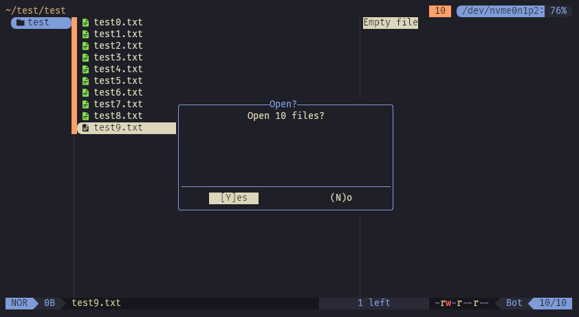

# confirm-open.yazi

A [Yazi](https://github.com/sxyazi/yazi) plugin to show a confirmation popup when
opening a large number of files.



Have you ever been selecting files, and gone to open one without thinking,
only to end up with about 100 windows popping up at once?

I have. One too many times. This is meant to prevent that.

## Installation

Install with `ya`:

```sh
ya pkg add walldmtd/confirm-open
```

## Usage

Add this to your `keymap.toml`:

```toml
prepend_keymap = [
    { on = "o", run = "plugin confirm-open", desc = "Open selected files"},
    { on = "<Enter>", run = "plugin confirm-open", desc = "Open selected files"}
]
```

By default, the popup will show when opening at least 10 files at once.
You can change this by calling the setup function in `init.lua`:

```lua
-- setup() is only needed if you want to change the threshold value
require("confirm-open"):setup({
    threshold = 10 -- Change as desired
})
```
