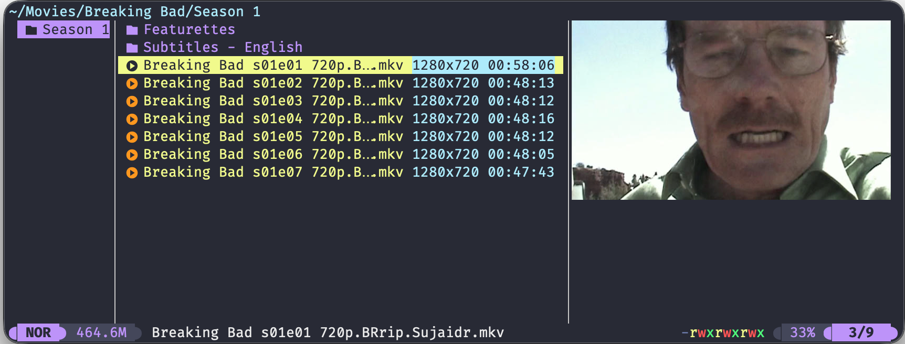
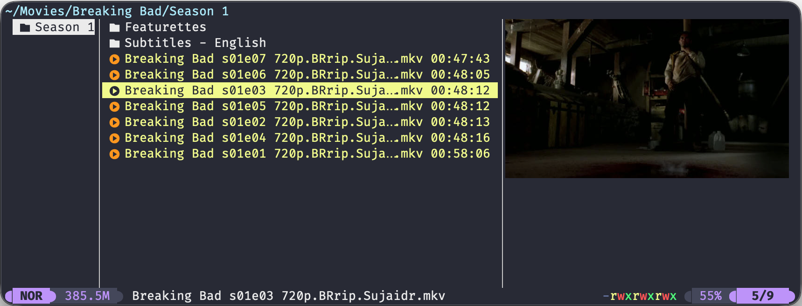

# ffmpeg-stats.yazi

A [Yazi](https://github.com/sxyazi/yazi) plugin that displays media file statistics in the linemode column using `ffprobe`.

**Note: If you previously installed this plugin and it has stopped working you need to update the prefetcher info in `yazi.toml`. You need to change `name = "*"` to `url = "*"`**



### Available stats

- **Duration** - Media length (HH:MM:SS format)
- **Resolution** - Video dimensions (e.g., 1920x1080)
- **Codec** - Video codec (e.g., H264, HEVC)
- **FPS** - Frame rate (e.g., 30fps, 29.97fps)
- **Bitrate** - Overall bitrate (e.g., 5.2Mbps, 320kbps)
- **Audio Codec** - Audio codec (e.g., AAC, OPUS)
- **Audio Channels** - Channel configuration (e.g., stereo, 5.1ch)
- **Format** - Container format (e.g., MP4, MKV)
- **Aspect Ratio** - Display aspect ratio (e.g., 16:9, 21:9)

All stats are cached per file and fetched efficiently in a single `ffprobe` call.

## Version Compatibility

This plugin supports two configurations depending on your Yazi version:

**Current Yazi (official release)**
- Linemode display only (toggle stats on/off)
- See [Current Version Usage](#current-version-usage) below

**Future Yazi (custom fork with sorting-by-linemode support)**
- Full linemode display + sorting support
- Requires my fork
- See [Future Version Usage (with Sorting)](#future-version-usage-with-sorting) below

## Requirements

- `ffprobe` available in your `PATH` (`ffprobe` is part of `ffmpeg`)

---

# Current Version Usage

In the current version of yazi this plugin supports showing the media stats in the linemode.

## Installation

1. Clone this plugin

    ```
    git clone https://github.com/grimandgreedy/ffmpeg-stats.yazi ~/.config/yazi/plugins
    ```

2. Register the fetcher

    ```toml
    # In ~/.config/yazi/yazi.toml
    [[plugin.prepend_fetchers]]
    id  = "ffmpeg_stats"
    url = "*"
    run = "ffmpeg-stats"
    ```

3. Load the plugin in `~/.config/yazi/init.lua`:

   ```lua
    require("ffmpeg-stats"):setup({
        -- Which stats should be shown by default upon opening yazi
        duration = false,
        resolution = false,
        codec = false,
        fps = false,
        bitrate = false,
        audio_codec = false,
        audio_channels = false,
        format = false,
        aspect = false,

        -- Uses theme colour by default
        -- style = ui.Style():fg("cyan"),
   })
   ```

## Keybindings

Add toggle commands to `~/.config/yazi/keymap.toml`:

```toml
# In ~/.config/yazi/keymap.toml

## ffmpeg linemodes - toggle individual stats
{ on = [ "m", "f", "d" ], run = "plugin ffmpeg-stats -- toggle-duration", desc = "Toggle duration" },
{ on = [ "m", "f", "r" ], run = "plugin ffmpeg-stats -- toggle-resolution", desc = "Toggle resolution" },
{ on = [ "m", "f", "c" ], run = "plugin ffmpeg-stats -- toggle-codec", desc = "Toggle codec" },
{ on = [ "m", "f", "f" ], run = "plugin ffmpeg-stats -- toggle-fps", desc = "Toggle FPS" },
{ on = [ "m", "f", "b" ], run = "plugin ffmpeg-stats -- toggle-bitrate", desc = "Toggle bitrate" },
{ on = [ "m", "f", "a" ], run = "plugin ffmpeg-stats -- toggle-audio-codec", desc = "Toggle audio codec" },
{ on = [ "m", "f", "h" ], run = "plugin ffmpeg-stats -- toggle-audio-channels", desc = "Toggle audio channels" },
{ on = [ "m", "f", "o" ], run = "plugin ffmpeg-stats -- toggle-format", desc = "Toggle format" },
{ on = [ "m", "f", "s" ], run = "plugin ffmpeg-stats -- toggle-aspect", desc = "Toggle aspect ratio" },

# Bulk toggle operations
{ on = [ "m", "f", "A" ], run = "plugin ffmpeg-stats -- toggle-all", desc = "Toggle all stats" },
{ on = [ "m", "f", "D" ], run = "plugin ffmpeg-stats -- disable-all", desc = "Disable all stats" },
```

---

# Future Yazi Version Usage (with Sorting)

## NOTE: SORTING IS NOT SUPPORTED IN THE YAZI STANDARD RELEASE



I created a [fork of yazi](https://github.com/grimandgreedy/yazi/tree/custom_sort) in which I implemented the ability to sort by linemode values. I am not sure if this will be merged into the release version. If you are reading this it is likely not yet supported.

The functionality is implemented and working but I still need to find time to check it over before I make a PR.


## Installation

1. Clone my fork of yazi: 

    ```
    git clone https://github.com/grimandgreedy/yazi
    cd yazi
    git checkout custom_sort
    ```

2. Build yazi and run the build version
    ```
    cargo build --release
    ./target/release/yazi
    ```

3. Clone this plugin

    ```
    git clone https://github.com/grimandgreedy/ffmpeg-stats.yazi ~/.config/yazi/plugins
    ```

4. Register the fetcher

   ```toml
   # In ~/.config/yazi/yazi.toml
   [[plugin.prepend_fetchers]]
   id  = "ffmpeg_stats"
   url = "*"   # Note that url (not name) is needed for the new version of yazi
   run = "ffmpeg-stats"
   ```

5. Load the plugin in `~/.config/yazi/init.lua`:

   ```lua
    require("ffmpeg-stats"):setup({
        -- Which stats should be shown by default upon opening yazi
        duration = false,
        resolution = false,
        codec = false,
        fps = false,
        bitrate = false,
        audio_codec = false,
        audio_channels = false,
        format = false,
        aspect = false,

        -- Uses theme colour by default
        -- style = ui.Style():fg("cyan"),
   })
   ```

## Keybindings

Add both toggle and sort commands to `~/.config/yazi/keymap.toml`:

```toml
# In ~/.config/yazi/keymap.toml

## ffmpeg linemodes - toggle individual stats
{ on = [ "m", "f", "d" ], run = "plugin ffmpeg-stats -- toggle-duration", desc = "Toggle duration" },
{ on = [ "m", "f", "r" ], run = "plugin ffmpeg-stats -- toggle-resolution", desc = "Toggle resolution" },
{ on = [ "m", "f", "c" ], run = "plugin ffmpeg-stats -- toggle-codec", desc = "Toggle codec" },
{ on = [ "m", "f", "f" ], run = "plugin ffmpeg-stats -- toggle-fps", desc = "Toggle FPS" },
{ on = [ "m", "f", "b" ], run = "plugin ffmpeg-stats -- toggle-bitrate", desc = "Toggle bitrate" },
{ on = [ "m", "f", "a" ], run = "plugin ffmpeg-stats -- toggle-audio-codec", desc = "Toggle audio codec" },
{ on = [ "m", "f", "h" ], run = "plugin ffmpeg-stats -- toggle-audio-channels", desc = "Toggle audio channels" },
{ on = [ "m", "f", "o" ], run = "plugin ffmpeg-stats -- toggle-format", desc = "Toggle format" },
{ on = [ "m", "f", "s" ], run = "plugin ffmpeg-stats -- toggle-aspect", desc = "Toggle aspect ratio" },

# Bulk toggle operations
{ on = [ "m", "f", "A" ], run = "plugin ffmpeg-stats -- toggle-all", desc = "Toggle all stats" },
{ on = [ "m", "f", "D" ], run = "plugin ffmpeg-stats -- disable-all", desc = "Disable all stats" },

## ffmpeg sorting - sort by media stats
{ on = [ ",", "f", "d" ], run = "plugin ffmpeg-stats -- sort-duration", desc = "Sort by duration" },
{ on = [ ",", "f", "D" ], run = "plugin ffmpeg-stats -- sort-duration-reverse", desc = "Sort by duration (reverse)" },
{ on = [ ",", "f", "r" ], run = "plugin ffmpeg-stats -- sort-resolution", desc = "Sort by resolution" },
{ on = [ ",", "f", "R" ], run = "plugin ffmpeg-stats -- sort-resolution-reverse", desc = "Sort by resolution (reverse)" },
{ on = [ ",", "f", "c" ], run = "plugin ffmpeg-stats -- sort-codec", desc = "Sort by codec" },
{ on = [ ",", "f", "C" ], run = "plugin ffmpeg-stats -- sort-codec-reverse", desc = "Sort by codec (reverse)" },
{ on = [ ",", "f", "f" ], run = "plugin ffmpeg-stats -- sort-fps", desc = "Sort by FPS" },
{ on = [ ",", "f", "F" ], run = "plugin ffmpeg-stats -- sort-fps-reverse", desc = "Sort by FPS (reverse)" },
{ on = [ ",", "f", "b" ], run = "plugin ffmpeg-stats -- sort-bitrate", desc = "Sort by bitrate" },
{ on = [ ",", "f", "B" ], run = "plugin ffmpeg-stats -- sort-bitrate-reverse", desc = "Sort by bitrate (reverse)" },
{ on = [ ",", "f", "a" ], run = "plugin ffmpeg-stats -- sort-audio-codec", desc = "Sort by audio codec" },
{ on = [ ",", "f", "A" ], run = "plugin ffmpeg-stats -- sort-audio-codec-reverse", desc = "Sort by audio codec (reverse)" },
{ on = [ ",", "f", "h" ], run = "plugin ffmpeg-stats -- sort-audio-channels", desc = "Sort by audio channels" },
{ on = [ ",", "f", "H" ], run = "plugin ffmpeg-stats -- sort-audio-channels-reverse", desc = "Sort by audio channels (reverse)" },
{ on = [ ",", "f", "o" ], run = "plugin ffmpeg-stats -- sort-format", desc = "Sort by format" },
{ on = [ ",", "f", "O" ], run = "plugin ffmpeg-stats -- sort-format-reverse", desc = "Sort by format (reverse)" },
{ on = [ ",", "f", "s" ], run = "plugin ffmpeg-stats -- sort-aspect", desc = "Sort by aspect ratio" },
{ on = [ ",", "f", "S" ], run = "plugin ffmpeg-stats -- sort-aspect-reverse", desc = "Sort by aspect ratio (reverse)" },
```
